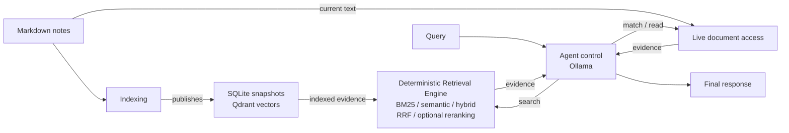

# ARKB

**Agentic Retrieval for Knowledge Bases** — an agentic knowledge retrieval system that separates dynamic agent control from deterministic retrieval over Markdown knowledge bases.

ARKB currently targets English notes and queries. UTF-8 text, source identities
and character ranges remain preserved. Active evaluation uses SciFact,
Bright-Pro technical domains and MuSiQue; earlier datasets and results are
retained for reference. See the [scope cleanup](docs/archive/english-scope-cleanup.md).

## Why ARKB

A fixed RAG pipeline follows a predefined sequence:

```text
query -> retrieve -> assemble context -> generate
```

ARKB treats retrieval as an iterative process controlled by an agent:

```text
query -> reason -> match / search / read -> observe -> repeat -> respond
```

The agent decides what evidence to gather next and when to stop. It can refine queries, expand promising sources, switch retrieval strategies, and continue retrieving when more context is useful. Queries that require no retrieval can receive a direct response.

The responsibilities are intentionally separated:

- **Agent control** chooses tools, search modes, queries, and when to stop.
- **Retrieval execution** performs matching, ranking, fusion, and reranking. It does not plan or generate answers.

This distinction matters because knowledge-base queries are not always question-answering queries.

For example:

```text
"Which notes mention RAG?"
    -> exact lexical retrieval

"Find notes related to agent memory."
    -> semantic or hybrid retrieval

"Find material for an article about AI agents."
    -> iterative search, reading, and synthesis

"What is retrieval-augmented generation?"
    -> retrieval followed by generation
```

## Features

- Agent-controlled iterative retrieval with `match`, `search`, and `read`.
- Obsidian-native navigation: wikilink and backlink traversal with `links`, and tag, folder and date filters on `list`.
- Deterministic exact, BM25, semantic, and hybrid retrieval with optional reranking.
- Local Markdown indexing with section-aware chunking and reusable embeddings.
- Inspectable agent traces and bounded tool-calling loops.
- Local Ollama or hosted Claude/DeepSeek models, with prompt caching and per-run cost accounting.
- Multi-turn sessions where follow-up questions reuse the evidence already collected.
- CLI with JSON output and reusable Python APIs.
- A read-only MCP stdio server, so Claude Code or the desktop app can be the agent instead.
- Retrieval baselines, agent evaluation, and controlled model ablations.

## Architecture



Indexing writes the persisted snapshots and vectors. Retrieval consumes them.

`Runtime` composes the agent, retrieval capabilities, knowledge access, and service clients. Direct `match` and `search` commands bypass the agent and expose deterministic retrieval behavior directly.

At a high level:

```text
Knowledge
    |
    v
Retrieval
    |
    +-------> Generation
    |
    +-------> Agent
                 |
                 +-------> Retrieval
                 +-------> Knowledge
                 +-------> Generation

Interfaces
    |
    v
 Runtime
```

Knowledge processing and retrieval remain independent from the agent. The agent acts as the control layer that dynamically composes those capabilities.

## Quick Start

### Requirements

- Python **3.13**
- [`uv`](https://docs.astral.sh/uv/)
- [`ripgrep`](https://github.com/BurntSushi/ripgrep) (`rg`)
- Ollama running at `http://127.0.0.1:11434`
- Qdrant Server running at `http://127.0.0.1:6333`

From the repository root:

```sh
uv sync --locked

ollama pull qwen3-embedding:0.6b
ollama pull qwen3.5:4b

uv run --locked arkb index --notes-dir example_notes
uv run --locked arkb status
```

The first index build downloads the pinned embedding tokenizer if it is not already cached.

Indexing uses section-aware, token-budgeted chunking, reuses compatible embeddings, and publishes a versioned snapshot after validation.

Recursive chunking now records algorithm `markdown-v2`. The next `arkb index`
publishes a new snapshot for an older chunking configuration while reusing
compatible embedding inputs; existing snapshots remain readable.

The default database is:

```text
.arkb/index.sqlite
```

The default vault ID is:

```text
default
```

Use `--host` and `--qdrant-url` to configure service endpoints, and `--db` and `--vault-id` to select index scope.

`--offline` prevents model-file and tokenizer downloads. Configured Ollama and Qdrant calls still occur.

To index your own notes, replace `example_notes` with your Markdown directory.

ARKB loads UTF-8 `.md` files under the specified directory, including subdirectories. A source is the vault-relative POSIX path of a note, such as `04-Areas/Career Development/note.md`; in a flat knowledge base it is simply the filename.

Directories whose name begins with `.` (`.obsidian`, `.trash`), plus `Attachments/` and `Excalidraw/`, are skipped. `--exclude <glob>` skips further directories by name or vault-relative path and may be repeated; the value is saved with the index so `match` and `ask` walk the scope that was indexed.

A leading `---` delimited YAML block is parsed into the note's metadata and removed from the body. A file that cannot be read or decoded is skipped, and a frontmatter block outside the parsed YAML subset leaves the note without metadata; `arkb index` reports both counts and lists the affected sources on stderr.

Indexing also resolves the note-to-note link graph — `[[wikilinks]]`, including `[[note|alias]]` and `[[note#heading]]`, and Markdown links to other `.md` files — and stores it with the snapshot, which is what the `links` tool reads; `arkb index` reports how many links it resolved. A target that names no note in the scanned scope is left out. A database built before this existed is upgraded in place by the next `arkb index`, which keeps its cached embeddings and rebuilds the snapshot to add the graph.

When an index already exists, `match` and `ask` use its saved directory. An explicit `--notes-dir` must agree with that scope.

## Usage

ARKB exposes seven top-level commands:

```text
match
search
ask
chat
index
status
mcp
```

All commands support `--json`, except `mcp`, whose stdout carries the protocol, and `chat`,
whose stdout carries the conversation.

Inspect command-specific options with:

```sh
uv run --locked arkb <command> --help
```

### Exact lexical retrieval

Find notes that explicitly contain a term:

```sh
uv run --locked arkb match "RAG" \
  --notes-dir example_notes \
  --top-k 10
```

`match` searches live Markdown content through ripgrep.

It returns literal occurrences with source paths and body character offsets.

It does not require an index, embedding model, Qdrant, or generation model.

`--top-k` limits occurrences, so multiple results may come from the same note.
Add `--unique-sources` to list each matching note once. The JSON response reports
`truncated: true` when more matches exist beyond `--top-k`.

### Semantic retrieval

Find knowledge related to a concept:

```sh
uv run --locked arkb search \
  "How can agents retain useful knowledge across sessions?" \
  --mode semantic \
  --top-k 5
```

### BM25 retrieval

Use lexical ranking when terminology matters:

```sh
uv run --locked arkb search \
  "agent memory" \
  --mode bm25
```

### Hybrid retrieval

Combine lexical and semantic candidates:

```sh
uv run --locked arkb search \
  "agent memory" \
  --mode hybrid \
  --top-k 5 \
  --json
```

`--source <path.md>` restricts `match` or `search` to one exact vault-relative source path.

### Agentic multi-step retrieval

Let the agent decide which retrieval actions to perform:

```sh
uv run --locked arkb ask \
  "Find notes about agent memory, read relevant sections, and explain how memory persistence differs from context compaction." \
  --max-turns 8 \
  --trace
```

Illustrative `--trace` output:

```text
[1] search
query: "agent memory"
mode: "semantic"

[2] read
source: "34_agent_memory_lifecycle.md"

[3] search
query: "context compaction"
mode: "hybrid"

[4] final
```

The actual queries and tool choices depend on the model and evidence collected during the run.

The trace is written to stderr. The final response remains on stdout.

With `--trace`, a usage summary follows the trajectory on stderr:

```text
usage: 5 request(s) | prompt 31,784 (uncached 31,784, cache read 0, cache write 0) | output 1,996
```

### Hosted models

`--generation-model` selects the transport by name: `claude-*` uses the Claude Messages API,
`deepseek-*` an OpenAI-compatible endpoint, and anything else the local Ollama server. The key
comes from the environment or from the nearest `.env` above the working directory
(`ANTHROPIC_API_KEY`, `DEEPSEEK_API_KEY`); a missing one is reported before any request is sent.
The Claude transport is an optional dependency (`uv sync --locked --extra claude`).

```sh
uv run --locked arkb ask "..." --generation-model claude-opus-5 --trace
```

For a hosted model the summary carries a second line estimated from the published list prices
recorded in `src/arkb/agent/transports.py` with the date they were read:

```text
cost: ~$0.0821 at claude-opus-5 list prices checked 2026-09-22
```

Every turn resends the whole conversation, so uncached input dominates that estimate. The Claude
transport marks three stable prefixes with `cache_control` — the tool definitions, the system
instruction, and the end of any conversation carried in from earlier turns — and never marks
content the current turn is still producing. DeepSeek caches prefixes server-side with no request
-side marking; its hits and misses are reported in the same summary. Ollama has no such notion.

### Follow-up questions

`arkb chat` keeps one conversation, one snapshot and one tool session open across questions, so a
follow-up can refer to the earlier answer and cite evidence the earlier turn already collected.
Each question still runs a complete agent loop with its own turn allowance and budget.

```sh
uv run --locked arkb chat \
  --db .arkb/index.sqlite --vault-id default \
  --generation-model qwen3.5:9b --trace
```

A blank line ends the session, `/reset` clears the conversation (and with it the evidence
references, which belong to the session that issued them), and `/trace` toggles the trajectory and
the per-turn usage summary.

### What a run is given

`ask` and `chat` share three settings that decide what the conversation opens with and how large
it may grow. None of them changes the tool contract or the budgets; each is off at zero or empty.

```sh
uv run --locked arkb ask "..." \
  --map-note "00-ObsSys/Vault Layout.md" \
  --small-scope-tokens 20000 --scope "04-Areas/Career Development" \
  --history-tokens 24000
```

`--map-note` names a note that describes how the knowledge base is organised, repeatable or
comma-separated, first one found wins. Its body opens the conversation as orientation: the model
is told it is a layout description, not evidence, so it has no evidence reference and cannot be
cited. A bare filename is matched against the filenames in scope, and a candidate that does not
exist is skipped. Default: empty, because the note is vault-specific.

`--small-scope-tokens` hands the model every note in scope instead of searching, when the scope
is estimated at or below that size; `--scope` restricts the delivery to one folder. The notes are
delivered as evidence with citable references and charged to the evidence allowance like any tool
result, and the run records the delivery in its trajectory as a `corpus` call. Default: 0, off —
this replaces retrieval rather than tuning it, so it is worth turning on when you know the scope
is small, and 20,000 suits a folder-sized one.

`--history-tokens` bounds the conversation: above it, the earliest tool observations lose their
bodies and keep a summary of the sources they delivered, within a run and, in `chat`, between
turns. The evidence references they issued remain citable, because those live in the tool session
and not in the messages. Default: 24,000, which the development set never reaches.

With `--trace`, a run that used any of them says so before the trajectory:

```text
[context] {"compacted_observations": 16, "map_note": "00-ObsSys/Vault Layout.md"}
```

### MCP server

Let Claude Code or the Claude desktop app retrieve from the knowledge base directly. In this
mode the outer client is the agent and ARKB contributes retrieval only, so no model runs inside
ARKB and no answer is generated here.

The MCP SDK is an optional dependency:

```sh
uv sync --locked --extra mcp

uv run --locked --extra mcp arkb mcp \
  --db .arkb/index.sqlite \
  --vault-id default \
  --qdrant-url http://127.0.0.1:6333
```

The server speaks the Model Context Protocol over stdio and serves until the client
disconnects. It takes the same scope options as the other commands (`--db`, `--vault-id`,
`--notes-dir`, `--exclude`, `--qdrant-url`, `--host`, `--offline`); `--mode` sets the default
search strategy, which a client may override per call. Relative paths resolve against the
server process's working directory, so prefer absolute paths in a client configuration, and
keep `rg` on the `PATH` that starts it, which `match` needs.

Register it with Claude Code (adjust the paths, and add `--scope user` to reuse it outside one
project):

```sh
claude mcp add arkb -- /abs/path/to/arkb/.venv/bin/arkb mcp \
  --db /abs/path/to/arkb/.arkb/index.sqlite \
  --vault-id default \
  --qdrant-url http://127.0.0.1:6333
```

For the desktop app, the same command goes into `claude_desktop_config.json`:

```json
{
  "mcpServers": {
    "arkb": {
      "command": "/abs/path/to/arkb/.venv/bin/arkb",
      "args": ["mcp", "--db", "/abs/path/to/arkb/.arkb/index.sqlite",
               "--vault-id", "default", "--qdrant-url", "http://127.0.0.1:6333"]
    }
  }
}
```

These tools are exposed, with the same names, descriptions and parameter schemas the internal
agent loop uses:

| Tool | Purpose |
| --- | --- |
| `list` | Browse source paths, titles, headings, sizes, tags and modification times; not evidence |
| `match` | Literal occurrences through ripgrep, over live files |
| `search` | Ranked chunks from the index: `bm25`, `semantic` or `hybrid` |
| `links` | The notes one note links to and the notes linking to it; not evidence |
| `read` | A whole note by source path, or the section around a returned offset |

`links` is advertised only when the index carries a link graph, which every index built by the
current version does.

The agent loop's `finish` tool is not exposed: the client writes the answer. Neither are its
`ev_*` evidence references, which bind evidence within one run of that loop. A client here is
another agent whose calls are independent, so every result instead carries its vault-relative
source path, the document revision it was read from, and body character offsets, which is
enough to quote a passage, re-read it and cite it.

The server is read-only by construction: it offers no tool that writes, deletes or rebuilds an
index, so a connected agent cannot change the knowledge base. Indexing stays with `arkb index`,
run deliberately by hand.

## Retrieval Engine

The retrieval engine is deterministic at the control-flow level and can be used independently from the agent.

| Method    | Purpose                              | Implementation                                                    |
| --------- | ------------------------------------ | ----------------------------------------------------------------- |
| Exact     | Exact occurrence discovery           | `ExactRetriever`, backed by ripgrep over live Markdown            |
| BM25      | Lexical relevance ranking            | In-memory ranking over title and body text from a SQLite snapshot |
| Semantic  | Conceptual similarity                | Ollama query embeddings with Qdrant vector search                 |
| Hybrid    | Sparse and dense candidate retrieval | BM25 and semantic candidates over the same snapshot               |
| Fusion    | Merge independent rankings           | Reciprocal Rank Fusion with stable identity-based tie breaking    |
| Reranking | Refine candidate ordering            | Optional `Qwen/Qwen3-Reranker-0.6B` scorer                        |

`RetrievalEngine.search` selects an explicit ranked retrieval mode:

```text
bm25
semantic
hybrid
```

`semantic` is the default.

Exact literal matching is intentionally exposed separately through `ExactRetriever` and the `match` command.

### Hybrid retrieval

Conceptually:

```text
                    Query
                      |
             +--------+--------+
             |                 |
            BM25            Semantic
             |                 |
             +--------+--------+
                      |
                     RRF
                      |
               optional rerank
                      |
                   Results
```

BM25 and semantic retrieval operate over the same indexed snapshot.

RRF combines the independent rankings before optional reranking.

### Reranking

Install the optional reranking dependencies:

```sh
uv sync --locked --extra rerank
```

Then run:

```sh
uv run --locked --extra rerank arkb search \
  "agent memory" \
  --mode hybrid \
  --rerank \
  --top-k 5
```

The current reranker uses the pinned `Qwen/Qwen3-Reranker-0.6B` model locally through PyTorch and Transformers.
It uses a 512-token input limit, with up to 128 query tokens (head and tail),
64 title tokens, and the remaining space for document body. It reserves at least
128 body tokens when the body is that long. Equal scores preserve incoming order;
all-equal scores, all-empty bodies, invalid scores, or expected scoring failures
preserve incoming ranking and score semantics with explicit fallback metadata.
Reranking remains optional: the [Phase B evaluation](docs/archive/phase-b-report.md) retains
SciFact gains but still finds regressions against Hybrid on long technical queries.

### Exact text vs exact vector search

Literal text lookup uses:

```sh
arkb match
```

By contrast:

```sh
arkb search --exact
```

requests exact vector search in Qdrant.

These are different operations.

### Snapshot behavior

BM25 queries require no model or vector service once a compatible snapshot exists.

Semantic and hybrid queries require embeddings but do not generate answers.

Re-run:

```sh
arkb index
```

after editing indexed notes.

`search` operates over indexed content.

`match` and `read` operate over current files.

As a result, saved locations can become stale when files change after indexing.

`status` reports saved state but does not verify live freshness or external-service health.

ARKB uses `.arkb/` for local state, `ARKB_*` for project-specific environment variables, and `arkb_*` for generated Qdrant collections.

Storage and identity schemas are now version 2. Rebuild pre-v2 and retired NumPy indexes into a new database with `arkb index --notes-dir <notes-directory> --db <new-database-path>`.

Renaming a database or collection does not migrate its IDs or embedding-cache keys. Previous databases and Qdrant collections remain untouched; model files can still be reused.

## Agentic Retrieval

The agent loop exposes three retrieval actions:

| Tool     | Purpose                                                            |
| -------- | ------------------------------------------------------------------ |
| `match`  | Locate known words, phrases, symbols, or explicit patterns         |
| `search` | Discover ranked evidence using BM25, semantic, or hybrid retrieval |
| `read`   | Expand a promising source and inspect additional content           |

The loop repeatedly feeds tool observations back to Ollama until the model returns a final response.

Conceptually:

```text
User Query
    |
    v
  Agent
    |
    +------ match
    |
    +------ search
    |
    +------ read
    |
    v
Observation
    |
    v
  Agent
    |
    +------ gather more evidence
    |
    +------ reformulate query
    |
    +------ inspect another source
    |
    +------ stop
    |
    v
Final Response
```

The agent can select an available search mode on each `search` call.

`match` and `search` return opaque evidence references. The Agent expands a result
with `read(ref="…")`, which returns the bounded heading section around the
evidence by default (`expand="snippet"` for the excerpt only, `expand="document"`
for the whole note), or reads a known source path with `read(source="notes/rag.md")`.
`match` lists occurrences by default; `unique_sources=true` lists each matching
note once, and every `match` response reports `truncated` when more matches exist
beyond `limit`. `search` returns ten ranked chunks by default. Under an evidence
budget, a result that does not fit is delivered as its fitting prefix with the
remainder recorded as withheld; a single oversized read is withheld with an
explicit error rather than silently trimmed.
References belong to one run and bind the source, revision and original span;
edits, deletions and renames produce recoverable errors. Low-level Python
document access still supports validated IDs, sections and ranges.

Each `ask` invocation starts a fresh conversation while retaining one retrieval snapshot across turns.

Direct replies and live document operations can work without an index. Choosing `search` requires a published snapshot.

The default generation model is:

```text
qwen3.5:4b
```

Thinking is enabled by default.

Use:

```text
--generation-model
--think
--no-think
```

to modify generation behavior.

`--max-turns` defaults to eight model requests and reserves the last request for
schema-constrained finalization. Earlier answers use the `finish` tool.

Tool or evidence-budget exhaustion closes evidence collection and allows an
answer from already delivered evidence. An unsupported answer must report
`insufficient_evidence`. A wall-clock deadline or fatal infrastructure failure
can still prevent a normal answer; the CLI returns a nonzero status and retains
a structured failure.

Expected tool misuse returns `recoverable_error` observations. Internal failures
return a terminal `fatal_error`; the runtime never substitutes empty success.
JSON output includes the canonical `final` (answer, status, resolved citations,
termination reason), conversation, request/tool accounting and reference mapping.
`response` remains the answer-text projection for existing consumers.

The default `ask` composition leaves reranking disabled. Prepared Python tools can configure reranking separately.

## Generation

The `generation/` package supports explicit generation workflows independently from the agent loop.

Its responsibilities include:

```text
retrieved evidence
        |
        v
context selection
        |
        v
token budgeting
        |
        v
generation
        |
        v
citation validation
```

The package provides context budgeting and validated citation APIs.

`ask` validates the structure and source/revision identity of final citations.
It does not apply the separate claim/quote validation stage from `generation/`,
and structural validity does not establish semantic support for an answer.

This keeps agent execution and explicit citation-aware generation as separate capabilities.

## Evaluation

ARKB includes evaluation infrastructure for both deterministic retrieval and agent behavior.

The versioned dataset:

```text
evaluation/data/agent_v1.jsonl
```

contains 40 cases across:

- Exact lookup
- Semantic discovery
- Direct reading
- Exploratory retrieval
- Knowledge QA
- No-retrieval tasks

### Implemented evaluations

| Evaluation                | Measurements                                                                                                                   |
| ------------------------- | ------------------------------------------------------------------------------------------------------------------------------ |
| Fixed retrieval baselines | Source Recall@K, MRR, nDCG@K, latency, and errors                                                                              |
| Agent evaluation          | Task success, source recall, required reads, tool usage, turns, stopping behavior, and unnecessary retrieval                   |
| Model ablation            | Repeated trials across generation models, success consistency, latency, evidence gathering, provenance, and input-drift checks |

The fixed retrieval baselines are:

```text
bm25
semantic
hybrid
hybrid_rerank
```

### Run retrieval baselines

```sh
uv run --locked python -m arkb.evaluation.runs \
  --baselines bm25 semantic hybrid \
  --output evaluation/results/baseline-demo
```

To include `hybrid_rerank`, install the reranking extra and run through:

```sh
uv run --locked --extra rerank
```

### Run agent evaluation

```sh
uv run --locked python -m arkb.evaluation.runs \
  --num-trials 3 \
  --output evaluation/results/agent-demo
```

### Model ablation

The default model ablation compares:

```text
qwen3.5:4b
qwen3.5:9b
qwen3.5:27b
```

over three trials per case.

Check prerequisites with:

```sh
uv run --locked python -m arkb.evaluation.model_ablation \
  --check-only \
  --output evaluation/results/ablation-check
```

Run a smaller subset experiment with:

```sh
uv run --locked python -m arkb.evaluation.model_ablation \
  --phase smoke \
  --output evaluation/results/ablation-smoke
```

Omit both `--check-only` and `--phase smoke` for the formal experiment.

Each output directory must be new.

Evaluation runs preserve JSON, JSONL, and Markdown artifacts for later analysis.

Additional evaluation APIs cover:

- Exact vs ANN retrieval
- Frozen-candidate reranking
- Context coverage
- Citation validity

Agent success currently measures evidence gathering and tool behavior. It does not grade final-answer correctness.

Baseline rankings and accumulated agent evidence use different retrieval budgets and should be compared accordingly.

See:

- [Evaluation guide](evaluation/README.md)
- [Deterministic retrieval baseline guide](docs/archive/deterministic-retrieval-baselines.md)
- [Agent model ablation guide](docs/archive/agent-model-ablation.md)

## Project Structure

```text
src/arkb/
├── agent/        # Tool definitions, state, bounded agent loop, and chat transports
├── knowledge/    # Markdown access, chunking, embeddings, indexing, persistence
├── retrieval/    # Exact, BM25, semantic, hybrid, fusion, and reranking
├── generation/   # Context construction, generation, and citation validation
├── evaluation/   # Datasets, metrics, baselines, agent runs, and ablations
├── interfaces/   # CLI and future external interfaces
├── config.py     # Runtime and retrieval configuration
└── runtime.py    # Capability composition and resource ownership
```

The main capability boundaries are:

```text
knowledge
retrieval
generation
agent
interfaces
evaluation
```

The design keeps deterministic knowledge processing and retrieval independent from agent control.

`tests/` mirrors the package capabilities at the top level.

`example_notes/` contains the sample Markdown corpus.

`evaluation/` and `benchmarks/` contain experiment inputs, configurations, and reports.

`interfaces/mcp_server.py` serves the read-only tools to an external agent over MCP stdio.

`interfaces/chat.py` holds the multi-turn session as a function over an iterator of input lines,
so the REPL's behavior is testable without a terminal. `agent/transports.py` holds the one
selection rule the CLI and the evaluation harness share, and the recorded list prices.

## Development

Install development dependencies:

```sh
uv sync --locked
```

Run the regular test suite:

```sh
uv run --locked python -m pytest -q -m "not integration"
```

These tests use local fixtures and mocked model services. `make test`, `make lint`
(ruff, pyflakes-level) and `make help` cover the everyday tasks; the
development evaluation for measuring agent changes is described in
[evaluation/README.md](evaluation/README.md), and
[docs/project-map.md](docs/project-map.md) gives a reading order for the code.

Exact matching tests require `rg` on `PATH`.

Real-model and external-service tests use the `integration` marker and explicit environment gates, including:

```text
ARKB_RUN_MODEL_TESTS
ARKB_QDRANT_URL
ARKB_RUN_RERANKER_TESTS
```

Capability-specific integration prerequisites are documented in the corresponding:

```text
tests/*/integration/
```

directories.

## Roadmap

Potential next steps:

- Recursive Markdown directory ingestion.
- Final-answer quality evaluation alongside retrieval and agent behavior metrics.

These items are not currently implemented.

## License

Licensed under the [Apache License 2.0](LICENSE).
