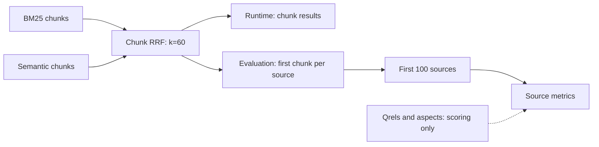

# ARKB Phase C: candidate generation and source-level fusion

Status: **In progress.** Development selection is frozen; BrowseComp-Plus full validation and final archival are still running. This is not a completed Phase C release.

The frozen product decision is **A: keep current chunk-level Hybrid fusion**. C1 and C2 do not satisfy the shared development gate. No runtime fusion, Agent, reranker, embedding, parser, chunking or publication behavior was changed. No later phase is implemented.

## 1. Baseline reproduction

Accepted Phase B production baseline: `75ba733`. The clean Phase C starting checkout was `84d2735` (Phase B report/evidence only). Development selection was committed at `5bd06c6`. Actual measured source hashes, rather than commit labels alone, identify every experiment. C0 reproduction preceded alternative implementation. Frozen P4 SQLite snapshots supplied exact chunk content and coordinates missing from earlier compact leg metadata.

| Dataset | Queries | Exact source ranks | Exact first-20 representatives | C0 nDCG@10 |
| --- | --- | --- | --- | --- |
| SciFact | 300 | 30000 | 6000 | 0.721640 |
| BRIGHT Stack Overflow | 115 | 11500 | 2300 | 0.480653 |
| BRIGHT Robotics | 101 | 10100 | 2020 | 0.390414 |

All 516 queries, 51,600 top-100 source ranks and 10,320 first-20 representative scores, revisions and spans match the accepted baseline exactly. Aggregate floating-point differences are at most rounding error. The later offline replay verified 258,000 rank positions and representative/provenance records across all five development arms, plus 62 paired-statistic replays, without retrieval or model calls. An initial metadata hydration draft is preserved separately; canonical semantic score type is `cosine_similarity`. It changed no score or ranking. See [baseline diagnostics](../evaluation/phase-c/v1/c0-diagnostics.json) and [offline replay](../evaluation/phase-c/v1/development-replay.json).

## 2. Current architecture

Production BM25 and Semantic retrieval return chunks from the same captured index snapshot. BM25 retains k1=1.2, b=0.75, NFC/casefold word tokenization over title and body, and unique query terms. Semantic retrieval retains the original query, pinned Qwen3 embedding model, 1,024 dimensions and cosine scoring. Exact source filters apply upstream. The normal runtime candidate depth remains 20 per leg; this benchmark retains the accepted P4 depth of 500 per leg and exact Qdrant retrieval.

Production Hybrid applies rank-only RRF with k=60 to chunk identities, one vote per chunk per named leg. Leg names are sorted and ties use the existing chunk identity order. **Production does not collapse sources.** The accepted P4 evaluation projection fuses the complete returned chunk union, keeps the first chunk of each source and then takes 100 sources. That first fused chunk is its representative. CLI and Agent use the same RetrievalEngine; Agent exposes its compact tool contract. This benchmark projection must not be confused with a runtime source-ranking API.

The diagram shows the shared ranking operation and the separate evaluation projection. Runtime default candidate depth is 20 per leg; this frozen benchmark captures 500 per leg.

Primary experiments stop before reranking. Phase B B3 is unchanged. The only source additions/changes are evaluation modules (`source_fusion.py`, the generic BEIR adapter and the separate BrowseComp adapter). The [scope audit](../evaluation/phase-c/v1/scope-audit.json) compares all source files, including newly added ones, against the accepted baseline.

## 3. Candidate availability

Recall is the mean of per-query positive-source recall. Leg and union columns use every source found within the frozen top-500 chunk legs; C0 uses its top 100 sources. The gap includes the final cutoff and ordering, so it is not evidence that fusion deleted candidates from its full union.

| Dataset | BM25 full-leg recall | Semantic full-leg recall | Union recall | C0 Recall@100 | Union-positive lost queries |
| --- | --- | --- | --- | --- | --- |
| SciFact | 0.943889 | 0.993333 | 0.996667 | 0.963333 | 10 |
| BRIGHT Stack Overflow | 0.824355 | 0.885916 | 0.940890 | 0.793428 | 49 |
| BRIGHT Robotics | 0.735016 | 0.747210 | 0.853976 | 0.649205 | 60 |

| Dataset | BM25-only positives | Semantic-only positives | Shared positives | Absent-both positives | Lost at C0 top100 positives |
| --- | --- | --- | --- | --- | --- |
| SciFact | 1 | 17 | 320 | 1 | 10 |
| BRIGHT Stack Overflow | 34 | 55 | 414 | 26 | 72 |
| BRIGHT Robotics | 66 | 88 | 371 | 98 | 142 |

Positive counts are query–document pairs, not globally distinct documents. BM25 contributes complementary positives in every domain: 1, 34 and 66 respectively. Do not disable it globally. Both candidate generation and final ranking limit BRIGHT: union recall is 0.9409 on Stack Overflow and 0.8540 on Robotics, but C0 top-100 recall is 0.7934 and 0.6492.

## 4. Source duplication analysis

| Dataset | Unique BM25 chunk-top100 | Unique Semantic chunk-top100 | Unique fused chunk-top100 | Duplicate competition queries |
| --- | --- | --- | --- | --- |
| SciFact | 96.936667 | 94.756667 | 95.873333 | 219 |
| BRIGHT Stack Overflow | 87.252174 | 79.695652 | 81.513043 | 115 |
| BRIGHT Robotics | 85.168317 | 91.584158 | 87.425743 | 101 |

Every C0/C1/C2 final source list contains 100 distinct sources. Duplicate competition means repeated sources occupy high chunk ranks before collapse; it does not mean duplicate sources survive in the final evaluation output. The next table counts distinct candidate chunks across both legs for each returned source, pooling source observations within each dataset. Earlier baseline diagnostics also retain means of query-level quantiles; these are different summaries.

| Dataset | Policy | Chunks/source mean | p50 | p90 | Union-positive lost queries | Lost positive pairs | Top10 score-tie queries |
| --- | --- | --- | --- | --- | --- | --- | --- |
| SciFact | C0 | 1.095500 | 1.000000 | 1.000000 | 10 | 10 | 42 |
| SciFact | C1 | 1.100833 | 1.000000 | 1.000000 | 10 | 10 | 46 |
| SciFact | C2 | 1.163200 | 1.000000 | 2.000000 | 10 | 10 | 39 |
| BRIGHT Stack Overflow | C0 | 1.802000 | 1.000000 | 3.000000 | 49 | 72 | 25 |
| BRIGHT Stack Overflow | C1 | 1.854870 | 1.000000 | 4.000000 | 44 | 69 | 12 |
| BRIGHT Stack Overflow | C2 | 2.062696 | 2.000000 | 4.000000 | 40 | 57 | 19 |
| BRIGHT Robotics | C0 | 1.615941 | 1.000000 | 3.000000 | 60 | 142 | 20 |
| BRIGHT Robotics | C1 | 1.647426 | 1.000000 | 3.000000 | 57 | 132 | 20 |
| BRIGHT Robotics | C2 | 1.862277 | 1.000000 | 3.000000 | 54 | 116 | 16 |

BRIGHT has substantial duplication, yet removing or aggregating it has domain-dependent consequences. More distinct sources in early chunk ranks alone is not a quality gain. Attribution categories overlap and must not be added into a single failure percentage.

## 5. Experiment matrix

The [preregistered architecture and protocol](phase-c-plan.md) and [protocol hash](../evaluation/phase-c/v1/protocol.json) were frozen before C1/C2 execution. All variants use identical legs, k=60, depth 500 per leg, top 100 unique sources and no reranker. No weights, k search, query rewriting, routers or additional algorithms were tried.

| Policy | Per-leg source construction | Between-leg fusion / representative |
| --- | --- | --- |
| C0 | Existing chunk RRF, then first-occurrence source collapse | Existing first fused chunk |
| C1 | Best distinct chunk per source; compact source ranks | RRF over source ranks; R0 |
| C2 | First two distinct chunks/source; sum 1/(60+raw chunk rank); order sources and compact ranks | Same source-rank RRF; R0 |
| C3 | Conditional contribution cap only if redundancy gate passed | Skipped: no gate passed |

C2 is a two-stage rank aggregation. It does not sum raw chunk scores directly between legs; using one chunk reduces it to C1. R0 distributes each final per-leg source vote among contributing chunks proportionally to their within-leg rank weights, sums chunk attribution across legs, then selects the largest contribution. New-policy ties follow first encounter in sorted-leg/input order. Existing C0 ties remain unchanged.

### SciFact

| Arm | ndcg@10 | recall@10 | recall@20 | recall@100 | mrr@10 |
| --- | --- | --- | --- | --- | --- |
| C0 | 0.721640 | 0.854556 | 0.894222 | 0.963333 | 0.683745 |
| C1 | 0.716292 | 0.844556 | 0.892722 | 0.963333 | 0.679009 |
| C2 | 0.612424 | 0.820111 | 0.892889 | 0.965000 | 0.548070 |
| bm25 | 0.660758 | 0.783833 | 0.832556 | 0.885889 | 0.626553 |
| semantic | 0.696062 | 0.838222 | 0.880000 | 0.946667 | 0.656655 |

| Policy − C0 | Metric | Mean Δ | 95% paired CI | W/T/L |
| --- | --- | --- | --- | --- |
| C1 | ndcg@10 | -0.005347 | [-0.014143, 0.003613] | 8/280/12 |
| C1 | recall@10 | -0.010000 | [-0.023333, 0.000000] | 0/297/3 |
| C1 | mrr@10 | -0.004735 | [-0.016132, 0.006741] | 7/281/12 |
| C1 | ndcg@20 | -0.003125 | [-0.011582, 0.005303] | 8/278/14 |
| C1 | recall@20 | -0.001500 | [-0.003833, 0.000000] | 0/298/2 |
| C1 | mrr@20 | -0.003826 | [-0.015182, 0.007694] | 7/281/12 |
| C1 | ndcg@100 | -0.002665 | [-0.011169, 0.005860] | 11/263/26 |
| C1 | recall@100 | 0.000000 | [0.000000, 0.000000] | 0/300/0 |
| C1 | mrr@100 | -0.003862 | [-0.015213, 0.007654] | 10/269/21 |
| C2 | ndcg@10 | -0.109215 | [-0.133100, -0.086185] | 11/189/100 |
| C2 | recall@10 | -0.034444 | [-0.056111, -0.016111] | 0/287/13 |
| C2 | mrr@10 | -0.135675 | [-0.167176, -0.104862] | 10/194/96 |
| C2 | ndcg@20 | -0.100310 | [-0.123516, -0.077722] | 14/183/103 |
| C2 | recall@20 | -0.001333 | [-0.006000, 0.003333] | 1/296/3 |
| C2 | mrr@20 | -0.133115 | [-0.164750, -0.102289] | 12/189/99 |
| C2 | ndcg@100 | -0.099529 | [-0.122881, -0.077056] | 18/166/116 |
| C2 | recall@100 | 0.001667 | [-0.005000, 0.010000] | 1/298/1 |
| C2 | mrr@100 | -0.133056 | [-0.164770, -0.102284] | 17/172/111 |

### BRIGHT Stack Overflow

| Arm | ndcg@10 | recall@10 | recall@20 | recall@100 | mrr@10 | alpha_ndcg@10 | aspect_recall@10 |
| --- | --- | --- | --- | --- | --- | --- | --- |
| C0 | 0.480653 | 0.525183 | 0.625935 | 0.793428 | 0.623706 | 0.489142 | 0.611014 |
| C1 | 0.470477 | 0.517381 | 0.646370 | 0.801972 | 0.606335 | 0.479112 | 0.601007 |
| C2 | 0.506996 | 0.544831 | 0.662391 | 0.825125 | 0.639275 | 0.510431 | 0.625493 |
| bm25 | 0.335965 | 0.369781 | 0.464304 | 0.650393 | 0.479110 | 0.349919 | 0.443693 |
| semantic | 0.343376 | 0.373035 | 0.483017 | 0.760329 | 0.493875 | 0.349819 | 0.441656 |

| Policy − C0 | Metric | Mean Δ | 95% paired CI | W/T/L |
| --- | --- | --- | --- | --- |
| C1 | ndcg@10 | -0.010176 | [-0.024343, 0.003592] | 28/49/38 |
| C1 | recall@10 | -0.007802 | [-0.023986, 0.007972] | 9/94/12 |
| C1 | mrr@10 | -0.017371 | [-0.047288, 0.009379] | 10/90/15 |
| C1 | ndcg@20 | 0.000838 | [-0.011938, 0.012730] | 35/35/45 |
| C1 | recall@20 | 0.020435 | [0.004348, 0.038986] | 10/102/3 |
| C1 | mrr@20 | -0.017725 | [-0.047300, 0.008569] | 11/87/17 |
| C1 | ndcg@100 | -0.002320 | [-0.014115, 0.008031] | 45/23/47 |
| C1 | recall@100 | 0.008544 | [0.000373, 0.018772] | 6/106/3 |
| C1 | mrr@100 | -0.017920 | [-0.047500, 0.008250] | 13/82/20 |
| C1 | alpha_ndcg@10 | -0.010030 | [-0.024853, 0.004874] | 33/43/39 |
| C1 | aspect_recall@10 | -0.010006 | [-0.034796, 0.013697] | 8/96/11 |
| C2 | ndcg@10 | 0.026343 | [-0.004118, 0.057533] | 51/23/41 |
| C2 | recall@10 | 0.019648 | [-0.006157, 0.047423] | 21/79/15 |
| C2 | mrr@10 | 0.015569 | [-0.039867, 0.070498] | 25/67/23 |
| C2 | ndcg@20 | 0.032112 | [0.006448, 0.058220] | 54/15/46 |
| C2 | recall@20 | 0.036456 | [0.008256, 0.068550] | 21/84/10 |
| C2 | mrr@20 | 0.016158 | [-0.038868, 0.070433] | 29/63/23 |
| C2 | ndcg@100 | 0.032103 | [0.007541, 0.056856] | 61/8/46 |
| C2 | recall@100 | 0.031698 | [0.015673, 0.050188] | 14/101/0 |
| C2 | mrr@100 | 0.015855 | [-0.039027, 0.070145] | 33/58/24 |
| C2 | alpha_ndcg@10 | 0.021289 | [-0.009206, 0.052517] | 50/22/43 |
| C2 | aspect_recall@10 | 0.014480 | [-0.015156, 0.044368] | 19/83/13 |

### BRIGHT Robotics

| Arm | ndcg@10 | recall@10 | recall@20 | recall@100 | mrr@10 | alpha_ndcg@10 | aspect_recall@10 |
| --- | --- | --- | --- | --- | --- | --- | --- |
| C0 | 0.390414 | 0.376942 | 0.473670 | 0.649205 | 0.630721 | 0.415825 | 0.485526 |
| C1 | 0.401902 | 0.393833 | 0.486226 | 0.662401 | 0.641486 | 0.425608 | 0.504336 |
| C2 | 0.436949 | 0.430605 | 0.514910 | 0.691090 | 0.663036 | 0.460221 | 0.543381 |
| bm25 | 0.248013 | 0.239378 | 0.334434 | 0.576337 | 0.441215 | 0.264433 | 0.319237 |
| semantic | 0.314017 | 0.281943 | 0.356099 | 0.564337 | 0.581734 | 0.339695 | 0.382823 |

| Policy − C0 | Metric | Mean Δ | 95% paired CI | W/T/L |
| --- | --- | --- | --- | --- |
| C1 | ndcg@10 | 0.011489 | [-0.000882, 0.026113] | 26/51/24 |
| C1 | recall@10 | 0.016890 | [0.001287, 0.033779] | 12/86/3 |
| C1 | mrr@10 | 0.010765 | [-0.018399, 0.044073] | 10/79/12 |
| C1 | ndcg@20 | 0.009300 | [-0.001825, 0.021973] | 33/36/32 |
| C1 | recall@20 | 0.012556 | [0.000455, 0.025653] | 10/88/3 |
| C1 | mrr@20 | 0.008493 | [-0.019914, 0.040530] | 11/75/15 |
| C1 | ndcg@100 | 0.010364 | [0.001395, 0.020634] | 47/21/33 |
| C1 | recall@100 | 0.013196 | [0.003941, 0.023936] | 10/90/1 |
| C1 | mrr@100 | 0.009427 | [-0.018908, 0.041452] | 14/72/15 |
| C1 | alpha_ndcg@10 | 0.009783 | [-0.003695, 0.026186] | 24/50/27 |
| C1 | aspect_recall@10 | 0.018810 | [-0.001382, 0.041518] | 8/90/3 |
| C2 | ndcg@10 | 0.046535 | [0.020967, 0.072304] | 55/15/31 |
| C2 | recall@10 | 0.053663 | [0.029929, 0.077458] | 37/55/9 |
| C2 | mrr@10 | 0.032316 | [-0.026165, 0.091944] | 26/56/19 |
| C2 | ndcg@20 | 0.040373 | [0.016575, 0.064509] | 58/12/31 |
| C2 | recall@20 | 0.041240 | [0.021237, 0.062019] | 29/67/5 |
| C2 | mrr@20 | 0.028352 | [-0.029309, 0.086853] | 27/54/20 |
| C2 | ndcg@100 | 0.040889 | [0.019129, 0.062441] | 65/8/28 |
| C2 | recall@100 | 0.041885 | [0.023846, 0.062139] | 22/78/1 |
| C2 | mrr@100 | 0.028856 | [-0.028913, 0.087369] | 29/52/20 |
| C2 | alpha_ndcg@10 | 0.044396 | [0.015608, 0.072755] | 55/13/33 |
| C2 | aspect_recall@10 | 0.057854 | [0.021315, 0.093154] | 30/62/9 |

Paired bootstrap uses seed 20260911 and 10,000 query resamples separately per dataset. Intervals are exploratory; no cross-dataset pooled bootstrap or combined quality score is used. Exact per-query equality defines ties. Independent pytrec_eval checks differ by at most 2.23e-16 for development standard metrics. BRIGHT aspect metrics retain the accepted P4 conventions.

### Fusion cost and movement

| Dataset | Policy | Mean ms | p50 ms | p95 ms | Mean candidate chunks | Mean signed common-source rank change |
| --- | --- | --- | --- | --- | --- | --- |
| SciFact | C0 | 23.819241 | 22.306896 | 31.103711 | 999.573333 | 0.000000 |
| SciFact | C1 | 6.825328 | 5.475188 | 13.784072 | 999.573333 | -0.068314 |
| SciFact | C2 | 6.962350 | 5.587035 | 7.436408 | 999.573333 | -1.651855 |
| BRIGHT Stack Overflow | C0 | 26.152440 | 25.108958 | 35.724629 | 1000.000000 | 0.000000 |
| BRIGHT Stack Overflow | C1 | 5.540369 | 5.005736 | 9.958635 | 1000.000000 | -0.766639 |
| BRIGHT Stack Overflow | C2 | 5.983342 | 5.482417 | 6.438645 | 1000.000000 | -2.506981 |
| BRIGHT Robotics | C0 | 27.029151 | 26.258958 | 32.396403 | 1000.000000 | 0.000000 |
| BRIGHT Robotics | C1 | 5.794349 | 5.078625 | 11.251958 | 1000.000000 | -0.453689 |
| BRIGHT Robotics | C2 | 6.419208 | 5.516070 | 14.281528 | 1000.000000 | -3.001743 |

Cost includes deterministic Python fusion, result construction and source collapse, excluding embedding and retrieval. Each query has one warmup and three timed repetitions with rotated policy order. Lower signed rank movement means promotion among common returned sources; it is not a positive-only quality metric. No isolated peak-memory measurement was made; all three methods process at most 1,000 leg results and retain bounded per-source contributors. C1/C2 are cheaper in this implementation, but their quality tradeoff fails the shared gate.

| Dataset | Policy | Recovered positives: queries/pairs | Lost C0 positives: queries/pairs | Positive promotions: queries/pairs | Positive demotions: queries/pairs |
| --- | --- | --- | --- | --- | --- |
| SciFact | C1 | 0/0 | 0/0 | 11/11 | 26/27 |
| SciFact | C2 | 1/1 | 1/1 | 20/20 | 116/137 |
| BRIGHT Stack Overflow | C1 | 6/6 | 3/3 | 71/112 | 80/158 |
| BRIGHT Stack Overflow | C2 | 14/15 | 0/0 | 93/216 | 85/151 |
| BRIGHT Robotics | C1 | 10/11 | 1/1 | 68/129 | 62/101 |
| BRIGHT Robotics | C2 | 22/27 | 1/1 | 87/210 | 71/150 |

C3 required both a C2–C1 nDCG@10 decline of at least 0.01 on BRIGHT and at least 10% of queries exhibiting the preregistered near-duplicate two-chunk distractor promotion. Neither BRIGHT domain met it: C2 improved versus C1, and measured redundant-promotion queries were zero. C3 was not executed.

## 6. Representative evidence analysis

Every checked representative retains its source, exact original content slice, coordinates and document revision. The full three-policy audit checks 154,800 source representatives. C1/C2 provenance additionally records the contributing chunks and rank-based vote attribution. No synthetic chunks, merged text or reranker-based selection were introduced.

| Dataset | Policy | Queries with representative/leg disagreement | Per-leg disagreement pairs | Mean changed representatives vs C0 |
| --- | --- | --- | --- | --- |
| SciFact | C0 | 199 | 763 | 0.000000 |
| SciFact | C1 | 218 | 907 | 1.026667 |
| SciFact | C2 | 247 | 1238 | 0.183333 |
| BRIGHT Stack Overflow | C0 | 114 | 1325 | 0.000000 |
| BRIGHT Stack Overflow | C1 | 114 | 1673 | 3.660870 |
| BRIGHT Stack Overflow | C2 | 114 | 1904 | 1.408696 |
| BRIGHT Robotics | C0 | 96 | 653 | 0.000000 |
| BRIGHT Robotics | C1 | 100 | 827 | 2.069307 |
| BRIGHT Robotics | C2 | 101 | 1011 | 0.683168 |

Disagreement is a diagnostic, not a weak-evidence label. Source qrels establish whether a document is relevant, not whether its selected chunk contains the needed evidence. Therefore representative semantic adequacy and the “positive source, weak chunk” failure rate are **not identifiable** from these labels. R1 was not needed to choose the shared policy and was not run. Phase D needs exact evidence-span judgments to evaluate this distinction.

## 7. Selected development policy

Exactly one policy is selected: **C0**. Selection was frozen at 2026-09-11T22:44:07.640817+00:00 before broader validation. The gate required SciFact nDCG loss ≤0.01, each BRIGHT loss ≤0.005, each Recall@10/20/100 loss ≤0.01, each BRIGHT aspect loss ≤0.01, and at least one BRIGHT nDCG gain ≥0.01 with a positive lower confidence bound. Prefer C1, then C2, then gated C3; otherwise retain C0.

C1 fails BRIGHT preservation and convincing-gain checks: Stack Overflow nDCG decreases by 0.010176 and its aspect metrics also cross their loss boundary. C2 improves Robotics nDCG by 0.046535, but SciFact decreases by 0.109215 and Recall@10 by 0.034444. Those regressions rule out one shared replacement. Validation does not reopen policy tuning. See [decision and individual gate results](../evaluation/phase-c/v1/development-decision.json).

## 8. Broader validation

Full query sets are fixed: NFCorpus 323, FiQA 648, BrowseComp-Plus 830. Full original corpora contain 3,633, 57,638 and 100,195 documents. Dataset revisions and individual download hashes are recorded in [acquisition revisions](../evaluation/phase-c/v1/acquisition-revisions.json) and normalized manifests. No query subsampling occurred. The generic BEIR adapter preserves original document/query IDs and official test labels. Its SciFact output remains byte-for-byte equivalent at the normalized data level to accepted P4.

FiQA contains 38 records with blank title and body, including positive document 117276. Following the user-approved exception, all raw records, queries and qrels remain intact while 57,600 nonempty records are indexed. Empty positives remain in metric denominators. This is explicitly not a claim that all 57,638 records produce vectors. The exception is independent of performance and leaves production parsing/embedding unchanged. See [exception manifest](../evaluation/phase-c/v1/empty-document-exception.json).

BrowseComp-Plus uses the pinned official corpus and all queries. Its evaluation-only adapter decodes the official query and support document IDs, verifies both evidence and gold ID sets against official GitHub qrels, and keeps labels separate from materialized documents. It does not read answers into ranking, filter by positives or invoke Agent. Original document text, IDs and URLs are preserved. Evidence-document and answer-bearing gold-document results remain separate. The [official benchmark](https://github.com/texttron/BrowseComp-Plus) and [pinned revision](../evaluation/phase-c/v1/browsecomp-official-revision.json) define these labels.

Selected C0 is identical to the current C0 control by construction, so one capture is reused instead of repeating retrieval under a new name. Selected-minus-C0 deltas are all zero, CI [0,0], and all queries tie. This verifies the retained baseline on new datasets; it does not provide an independent treatment estimate or a generalization result for rejected C1/C2.

### NFCorpus

The READY index contains 3,633 documents and 3,930 chunks. The normal builder reused 3,887 embedding inputs and embedded 0 additional inputs; build time was 8.391 seconds, excluding the separately recorded embedding-cache preparation. Full before/after snapshot verification passed.

| Arm | Label set | ndcg@10 | recall@10 | recall@20 | recall@100 | mrr@10 |
| --- | --- | --- | --- | --- | --- | --- |
| bm25 | qrels | 0.306070 | 0.148537 | 0.178620 | 0.235868 | 0.513001 |
| semantic | qrels | 0.354010 | 0.173418 | 0.218431 | 0.333007 | 0.554422 |
| C0 | qrels | 0.362743 | 0.175986 | 0.216958 | 0.335296 | 0.574160 |

| Arm | Returned sources mean | min | max |
| --- | --- | --- | --- |
| bm25 | 272.529412 | 0 | 499 |
| semantic | 473.755418 | 449 | 488 |
| C0 | 650.718266 | 460 | 912 |

| Observed retrieval leg | Mean ms | p50 ms | p95 ms | Mean returned chunks |
| --- | --- | --- | --- | --- |
| bm25 | 25.425435 | 19.612458 | 60.113400 | 281.535604 |
| semantic | 119.822502 | 119.091292 | 127.208996 | 500.000000 |

These are observed single-capture search timings, including query embedding for Semantic and result hydration, excluding offline fusion and index preparation. They are not repeated isolated latency measurements or default-depth/Agent latency estimates. Other corpus preparation could share host resources.

Full per-query rankings, raw legs, metric/reference checks and snapshot/environment identities are preserved in the run directory; [summary](../evaluation/phase-c/v1/validation/nfcorpus-summary.json), [protocol](../evaluation/phase-c/v1/validation/nfcorpus-protocol.json), [execution metadata](../evaluation/phase-c/v1/validation/nfcorpus-experiment.json).

### FiQA

The READY index contains 57,600 documents and 60,430 chunks. The normal builder reused 60,413 embedding inputs and embedded 0 additional inputs; build time was 136.563 seconds, excluding the separately recorded embedding-cache preparation. Full before/after snapshot verification passed.

| Arm | Label set | ndcg@10 | recall@10 | recall@20 | recall@100 | mrr@10 |
| --- | --- | --- | --- | --- | --- | --- |
| bm25 | qrels | 0.233674 | 0.295940 | 0.353170 | 0.510686 | 0.291767 |
| semantic | qrels | 0.444907 | 0.530731 | 0.607270 | 0.784028 | 0.520853 |
| C0 | qrels | 0.369652 | 0.447866 | 0.536860 | 0.749208 | 0.448896 |

| Arm | Returned sources mean | min | max |
| --- | --- | --- | --- |
| bm25 | 489.530864 | 266 | 500 |
| semantic | 487.657407 | 456 | 500 |
| C0 | 852.572531 | 647 | 982 |

For qrels labels, C0 nDCG@10 is 0.075255 lower than Semantic alone. This identifies a limitation of the retained baseline on this validation corpus. It is recorded without reopening fusion selection, introducing domain routing or disabling BM25. Rejected C1/C2 policies were not evaluated here.

| Observed retrieval leg | Mean ms | p50 ms | p95 ms | Mean returned chunks |
| --- | --- | --- | --- | --- |
| bm25 | 492.745339 | 537.272395 | 573.514223 | 499.657407 |
| semantic | 126.641823 | 124.799230 | 133.539316 | 500.000000 |

These are observed single-capture search timings, including query embedding for Semantic and result hydration, excluding offline fusion and index preparation. They are not repeated isolated latency measurements or default-depth/Agent latency estimates. Other corpus preparation could share host resources.

Full per-query rankings, raw legs, metric/reference checks and snapshot/environment identities are preserved in the run directory; [summary](../evaluation/phase-c/v1/validation/fiqa-summary.json), [protocol](../evaluation/phase-c/v1/validation/fiqa-protocol.json), [execution metadata](../evaluation/phase-c/v1/validation/fiqa-experiment.json).

### BrowseComp-Plus

**Pending full-corpus index/capture completion. No validation score is reported.**

BrowseComp official Recall@5/@100/@1000 and nDCG@10 are calculated on the available source ranking from the fixed 500-chunk legs. A semantic or BM25 leg returns at most 500 sources; fused depth is at most 1,000 and often smaller. Recall@1000 therefore measures this configuration’s actual candidate coverage, not a separately retrieved 1,000-source pool. Primary source cutoff remains 100. TREC exports use strictly decreasing rank scores to preserve tied-source ordering in independent evaluation.

Storage preparation required a user-authorized external APFS sparse image. Qdrant host-bind mounts reported incompatible FUSE storage and failed before retrieval. The successful runs use a separate native Docker volume with the same Qdrant 1.19.0 image and index parameters. Existing services and historical READY snapshots were not changed. Failed attempts are retained and produced no scored rankings. Cache staging uses the exact production chunker, tokenization, embedding model and SQLite keys; the normal builder validates and publishes the final snapshot. See [storage incident](phase-c-storage-note.md).

## 9. Final product decision

**Decision A — keep current chunk-level Hybrid fusion.** This is the frozen development decision; Phase C completion still requires every pending validation/verification/archive item reported here. The alternatives offer a CPU cost improvement and some BRIGHT gains but fail the shared quality requirements. No dataset-specific routing, BM25 disabling, new RRF parameter or forced source-level redesign is justified. Production remains unchanged; experimental policies are confined to evaluation code.

## 10. Tests

| Suite/subset | Cases | Passed | Failed | Errors | Skipped |
| --- | --- | --- | --- | --- | --- |
| deterministic | 1193 | 1193 | 0 | 0 | 0 |
| service_integration | 60 | 60 | 0 | 0 | 0 |
| evaluation_regression | 289 | 289 | 0 | 0 | 0 |
| phase_a_regression | 378 | 378 | 0 | 0 | 0 |
| phase_b_reranker_focused | 48 | 48 | 0 | 0 | 0 |
| phase_b_reranker_integration | 5 | 5 | 0 | 0 | 0 |
| new_phase_c_deterministic | 41 | 41 | 0 | 0 | 0 |

Freshness/update checks: 16 passed, 0 failed.

Subsets overlap: evaluation, Phase A, Phase B and new Phase C cases are contained in the deterministic/service suites and must not be summed. Phase A covers Agent contracts, exact match/read, runtime and CLI. Phase B covers reranker input budgets, stable scoring/fallback and real long-query inference. New Phase C tests exercise source aggregation, rank semantics, identity/provenance, filtering, ties, source uniqueness, representatives, BEIR/BCP normalization and the explicit empty-document denominator rule. Freshness uses real SQLite/Qdrant/model services to verify old indexed snapshots alongside changed live reads, stale references, edits, renames, deletes and publication.

The source scope audit reports zero non-evaluation production changes against `75ba733`. Source-fusion ranking/statistics and validation ranks/metrics are also replayed from archived legs with zero new model calls. Test seams follow the requested public source-fusion and external-adapter boundaries. Red/green traces are retained.

## 11. Remaining issues

| Area | Evidence and next question |
| --- | --- |
| Candidate generation | BRIGHT Robotics union recall is 0.8540 at 500 chunks/leg; missing evidence cannot be recovered by fusion. Lexical-only positives remain useful. |
| Fusion | The union-to-top100 gap is real, but C1/C2 do not provide a robust shared replacement. Source duplication alone is an insufficient optimization target. FiQA validation also exposes a retained-baseline weakness: Semantic nDCG@10 0.444907 versus C0 0.369652. This remains a recorded limitation rather than a validation-driven tuning loop. |
| Chunk representation | Exact provenance is verified, but source relevance cannot establish representative-chunk adequacy. Need evidence-span labels. |
| Reranker | B3 compatibility/regression is preserved; no reranker quality claim is inferred from rerank-off Phase C experiments. |
| Agent policy | No BrowseComp Agent evaluation, query rewriting or policy learning ran. Retrieval quality does not establish end-to-end task success. |
| Evaluation | Public labels are exposed, confidence intervals exploratory, qrels incomplete for unjudged documents, and no ARKB-native production distribution has been measured. FiQA has the explicit 38-empty-record exception; BCP cutoff metrics reflect actual available depth. Full BCP indexing is an operational scale/cost issue and must not be hidden by corpus reduction. |

## 12. Phase D handoff

Stable inputs for Phase D are the retained chunk Hybrid baseline, unchanged Phase A tool/execution contract, unchanged Phase B B3 reranker, exact source/revision/span provenance, reusable official-data adapters, and frozen candidate-loss diagnostics. Native dataset construction should distinguish a missing candidate, a rank loss, a relevant source represented by the wrong span, and stale/live evidence behavior. Separate development and held-out native queries; preserve annotator judgments, exact evidence spans and versioned snapshot identities. These are handoff requirements, not a Phase D implementation.

Phase E must reuse `/Volumes/ARKBPhaseC/data/browsecomp-plus` and its completed Phase C SQLite/Qdrant snapshot, original 830 query IDs and frozen retrieval configuration. Do not regenerate queries or redefine corpus scope. The external sparse image lives at `/Volumes/闪迪1T/arkb-phase-c-v1/arkb-phase-c.sparseimage`; mount it at the recorded location for live document access. Archive manifests record exact hashes and restore paths. Full BrowseComp query text and raw retrieval evidence stay in local controlled artifacts rather than public report tables.

Reproduction: use a fresh output path with `evaluation/experiments/validate_phase_c.py`; model/service access is required only for original indexing/capture. `evaluation/audits/replay_phase_c.py` and `replay_phase_c_validation.py` reproduce saved ranks, provenance and statistics offline. Source/configuration copies and hashes accompany each run. Existing P4/Phase A/Phase B evidence is preserved.
